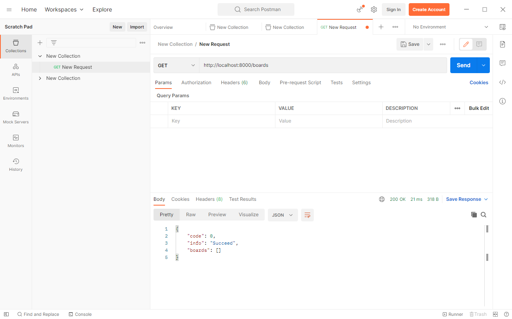

# 什么是后端

- 与前端进行数据交互
- 操作与管理持久性存储

---

## 与前端进行数据交互: 请求类型

**面对前端的查询请求 (GET 方法) 要返回相应的数据供前端渲染**, 比如用户点开网页后首页要进行视频推荐, 用户可以查看自己的个人信息

**面对前端的修改请求** (POST 方法、PUT 方法、DELETE 方法, 分别对应创建、修改、删除) **要在检查后做出响应**, 比如用户可以上传视频、发表评论、修改个人信息、删除视频等等

---

## 与前端进行数据交互: 请求体格式

- 后端与前端的交互通过网络请求的格式进行, 而最常用的数据规范便是 JSON 格式 (JavaScript Object Notation) 

- JSON 将数据组织成键值对的形式, 其值涵盖的类型包括: object, array, number, string, Boolean (true / false) 和 null

-  很多高级语言都支持 JSON 格式与自身自带的 HashMap 容器的高效转换, 比如在 Python 中, json 库可以将 JSON 字符串与 dict 进行转换

---

## 操作与管理持久化存储

- 操作与管理持久化存储是由于我们需要将用户的数据高效地组织起来, 以供后续查询与修改

- 这里的“持久化存储”是一个相对广泛的概念
  - 对于简单的开发需求, 文件系统也可以满足这个“数据库”的要求, 用户的数据可以直接存储成文件的形式
  - 面对更大体量的数据, 面对更快的查询与修改需求, 各种各样的数据库软件是不可或缺的
  - 在小作业中我们采用本地存储 SQLite3, 在大作业中你~~也不太~~可能会用到 MySQL, MongoDB, PostgreSQL 等等

---

## 操作与管理持久化存储: ORM 机制

- 关系型数据库是数据库的一种, 一个数据库应用中可以创建若干个数据库, 每个数据库又可以包含若干个数据表

-  可以将数据表与一个实体类联系起来, 将每一列看做是这个实体类的一个具体的成员变量, 每一行看成是这个类的一个实例

- 将每张数据表看做是相同类的实体构成的集合, 这种观点就是 ORM 机制

---

# 后端的调试

## 人工调试: Postman

- Postman 是一种常用的 API 开发工具, 它可以帮助开发人员快速创建、测试、调试和文档化 API

- Postman 提供了一个直观的用户界面, 使得开发人员可以轻松地构建HTTP请求, 并查看和分析响应

- 它支持各种HTTP方法, 包括 GET、POST、PUT、DELETE 等

- 它支持各种数据格式, 例如 JSON、XML 等

- https://www.postman.com/

---

## 人工调试: Postman

---

## 自动化测试: 单元测试

- 测试工程师撰写相应的测试代码, 涉及到一般情况与尽可能多的 Corner Cases

- 一方面, 这能帮助开发工程师有效开发; 另一方面, 在一个大型项目中可能会出现改动一部分代码导致另一部分代码的原有功能失效的情况, 而通过固定的测试程序与测试用例则可以保证只有稳定的版本才会最终呈现给用户

- Python 有 pytest 等测试框架

---

## 自动化测试: 测试流程

- 测试工程师将开发工程师撰写的后端逻辑视为黑盒 (但是前端和数据库都是白盒)

- 测试工程师可以直接模拟前端请求, 读取与修改数据库中的内容

- 测试工程师可以通过一系列断言验证程序的正确性

测试工程师就像是在设计 OJ 测例, 断言后端系统在面对输入 (用户请求) 时, 应该产生什么样的输出 (对用户请求的响应、对数据库的修改). 若断言失败, 则说明开发工程师提交的本次修改存在功能性问题, 需要进行修复. 

* 这通常意味着 *测试者不能是开发者*, 否则测试能想到的问题常常在开发者心中早已存在, 那么开发时就已经考虑到了, 这就失去了测试的意义

---

# 后端框架

##

一个成熟的后端框架往往具备以下解耦合的功能: 

- 路由: 将前端请求的不同路径映射到不同的处理函数的方法

- 模型: 与数据库进行交互的方法, 可以使用 ORM 机制撰写成面向对象风格

- 视图: 前端请求的处理函数, 接受用户请求并返回响应

- 模板: 将数据渲染成 HTML 页面的方法 (因为后端框架常常可以作为传统的 Web 服务器使用)

- 单元测试: 如何为测试工程师提供模拟请求、读写数据库、断言的操作

*  这里的“路由”、“模型”、“视图”都是 Django 中的概念, 在其他的后端框架中它们不一定被如此称呼, 但你可以在学习其他后端框架时找到这些概念的影子, 比如 MVC 模型等. 

---

# 还有很多东西...

- MVC: https://en.wikipedia.org/wiki/Model%E2%80%93view%E2%80%93controller
- BurpSuite: https://portswigger.net/burp
- ORM: https://stackoverflow.com/questions/1279613/what-is-an-orm-how-does-it-work-and-how-should-i-use-one
- About Unit Test: https://softwareengineering.stackexchange.com/questions/446061/what-is-the-point-of-unit-tests