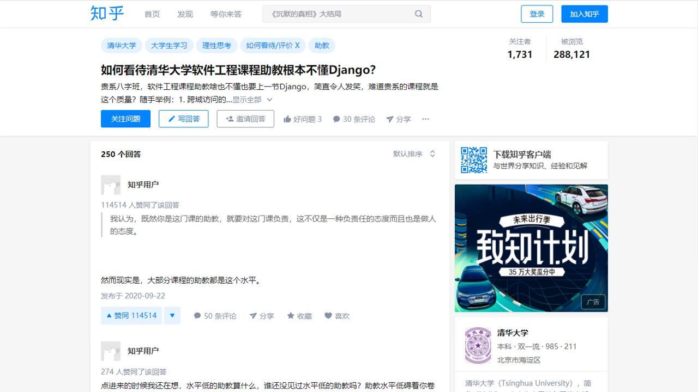

# Django 简介 : 我们不是专业搞后端开发的...

##

<div style="text-align: center; width: 75%">



</div>

如果你知道什么我们讲的东西不是最佳实践, 欢迎直接指正.

另请参考 Django 官方文档 https://docs.djangoproject.com/en/5.2/

---

<div style="display: flex; flex-direction: row; width: 100%; height: 100%; gap: 1em;">

<div style="flex: 1;">

## 项目与应用

- 项目文件夹是一个 Django 项目的顶层模块，其中含有 settings.py, asgi.py, wsgi.py 三个特殊的文件

- 一个 Django 项目中可以同时存在多个应用，一个应用是具有完成某个独立功能作用的模块

</div>

<div style="width: 50%; display: flex; justify-content: space-around; flex-direction: column;">

```plaintext
.
├── DjangoHW           # 我们的项目叫 DjangoHW 
│   ├── asgi.py
│   ├── __init__.py
│   ├── settings.py
│   ├── urls.py
│   └── wsgi.py
├── board              # 我们新建了一个应用叫 board
│   ├── admin.py
│   ├── apps.py
│   ├── __init__.py
│   ├── models.py
│   ├── tests.py
│   ├── urls.py
│   └── views.py
├── Dockerfile
├── manage.py
├── pytest.ini
├── README.md
├── requirements.txt
└── utils              # 一些功能函数在这里；也可以放在
                       # 其他的文件夹下，只要引用路径正确即可
    ├── utils_jwt.py
    ├── utils_request.py
    ├── utils_require.py
    └── utils_time.py
```

</div>

</div>

---

## 路由

首先，我们来解决后端收到请求时，后端会将请求交给哪个应用的哪个视图函数处理的问题。和这个功能有关的文件主要为项目文件夹和应用文件夹下的 `urls.py`。

假如我们的后端部署在 `my-backend.com`，我们在访问 <code><span style="color: lightgreen;">my-backend.com/</span><span style="color: orange">board/</span><span style="color: cyan">restart</span></code> 时，后端会首先在项目文件夹下的 `urls.py` 中以 <code><span style="color: orange">board/</span><span style="color: cyan">restart</span></code> 开始搜索。假设其配置为：

```python
urlpatterns = [
    path('board/', include("board.urls")),
]
```

我们会**匹配掉**字符串 <code><span style="color: orange">board/</span></code>，然后将剩下的请求 <code><span style="color: cyan">restart</span></code> 交给 `board/urls.py` 处理。假设子应用的 `urls.py` 配置为：

```python
urlpatterns = [
    path('restart', views.restart_board),
]
```

这时剩余请求 <code><span style="color: cyan">restart</span></code> 匹配到第一条规则后，交由 `board/views.py` 中的 `restart_board` 函数进行处理，即后端会帮助我们调用这个函数，并把请求体（和请求有关的信息，包括请求方法、请求数据等等）作为参数传给这个函数。

---

## 模型

- 在 Django 中，模型用于数据库中数据表的结构设计以及数据表的元数据（如主键、外键、索引等）管理。我们使用 Django 提供的 ORM 机制来进行对数据表和数据表列属性的管理。具体来说，我们只需要在 &lt;app>/models.py 中定义一个类继承 `django.db.models.Model` 即可。

    ```python
    from utils import utils_time
    from django.db import models
    from utils.utils_request import return_field

    from utils.utils_require import MAX_CHAR_LENGTH
    
    class User(models.Model):
        id = models.BigAutoField(primary_key=True)
        name = models.CharField(max_length=MAX_CHAR_LENGTH, unique=True)
        password = models.CharField(max_length=MAX_CHAR_LENGTH)
        created_time = models.FloatField(default=utils_time.get_timestamp)
    ```

- 在你修改完应用的 models.py 之后，你应该使用如下命令去生成修改数据表结构与属性的语句：
    ```bash
    python3 manage.py makemigrations <app_name>
    ```

---

<div style="display: flex; flex-direction: row; width: 100%; height: 100%; gap: 1em;">

<div style="flex: 1;">

## 视图

视图函数是后端逻辑的主入口，其接受经过路由之后的 HttpRequest 类型的请求作为参数，并返回一个 HttpResponse 类型的对象作为响应。

我们可以在 `<app>/views.py` 中定义一个应用所具有的视图函数。在这里举一个留言板应用“获取与创建留言”的视图函数作为例子。

</div>

<div style="width: 60%; display: flex; justify-content: space-around; flex-direction: column;">

```python
def user_board(req: HttpRequest, userName: str):
    if not isinstance(userName, str):
        return request_failed(
            -1, "Bad param [userName]", status_code=400)
    
    user = User.objects.filter(name=userName).first()
    if user is None:
        return request_failed(
            1, "User not found", status_code=404)
    
    
    if req.method == "GET":
        return request_success(user.serialize())
    
    else:
        return BAD_METHOD
```

</div>

</div>

---

<div style="display: flex; flex-direction: row; width: 100%; height: 100%; gap: 1em;">

<div style="flex: 1;">

## 单元测试

- 在 Django 中，测试工程师会将开发工程师所编写的路由与视图视为黑盒，通过 `django.test.TestCase` 类与 `django.test.Client` 类来模拟前端与开发工程师所撰写的后端交互，并通过其提供的断言函数来断言响应所应该具有的属性或是数据库应被如何修改。

</div>

<div style="width: 50%; display: flex; justify-content: space-around; flex-direction: column;">

<div style="--scale: 0.6; transform: scale(var(--scale)); transform-origin: top left; width: calc(100% / var(--scale));">

```python
import random
from django.test import TestCase, Client
from board.models import User, Board
import datetime
import hashlib
import hmac
import time
import json
import base64

from utils.utils_jwt import EXPIRE_IN_SECONDS, SALT, b64url_encode

# Create your tests here.
class BoardTests(TestCase):
    # Initializer
    def setUp(self):
        holder = User.objects.create(name="Ashitemaru", password="123456")
        Board.objects.create(
            user=holder, board_state="1"*2500, board_name="Ashitemaru's board")
        
    # ! Utility functions
    def generate_jwt_token(self, username: str, payload: dict, salt: str):
        # * header
        header = {
            "alg": "HS256",
            "typ": "JWT"
        }
        # dump to str. remove `\n` and space after `:`
        header_str = json.dumps(header, separators=(",", ":"))
        # use base64url to encode, instead of base64
        header_b64 = b64url_encode(header_str)
        
        # * payload
        payload_str = json.dumps(payload, separators=(",", ":"))
        payload_b64 = b64url_encode(payload_str)
        
        # * signature
        signature_str = header_b64 + "." + payload_b64
        signature = hmac.new(
            salt, signature_str.encode("utf-8"), digestmod=hashlib.sha256).digest()
        signature_b64 = b64url_encode(signature)
        
        return header_b64 + "." + payload_b64 + "." + signature_b64
```

</div>
</div>

</div>

---

# 还有很多东西...

- Django 文档: https://docs.djangoproject.com/en/5.2/
- Django REST framework: https://www.django-rest-framework.org/
- 科协文档: https://docs.net9.org/backend/django/django/
- Django 官方教程: https://docs.djangoproject.com/en/5.2/intro/tutorial01/
- Django Admin 主题: https://www.djangoproject.com/weblog/2025/apr/18/admin-theme-roundup/
