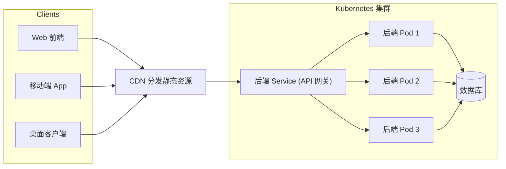
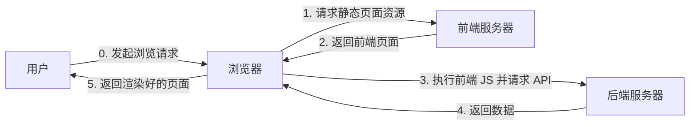
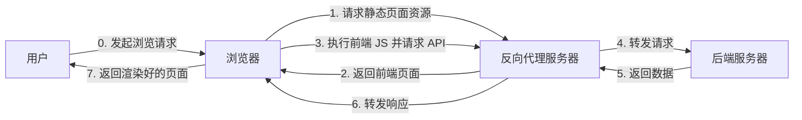

# 前后端分离 - 为什么?

- 很多人问, 为什么要做前后端分离?
- 答: 其实也不一定要做前后端分离. 但是, 前后端分离 **有很多优势**. 因此我希望大家真正了解为什么要这样做.

## 考虑这样一个需求 ---

- 你要做一个大模型 API 分发的网站, 用户数量是计算机系的同学, 我们就假设有 2000 人
- 这个网站用清华 Git OAuth 鉴权, 一个静态网页用来展示有哪些模型, 一个网页用来显示当前用户的 Token 和用量

## 此时...

- 需求很简单, 我们让 GPT 糊了一些 CSS 和 HTML, 嵌在 Flask 里面当模板渲染出来, 用不着分离.
- 代码加起来总共不到 5kB; 如果使用前后端分离的架构, 那么 React 的默认项目就超过这个规模.
- 这就是 https://dify.net9.org/verynbforwardserviceforzhipuapibyxiaoaojianghu/ (哦, 现在挂了)

---

## 后来, 需求变成了这样...

- 你要做一个大模型 API 分发的网站, 用户数量是 **清华全校** 的同学, 假设有 100,000 人
- 你需要提供 **漂亮的界面** 给非计算机方向的同学直接用, 类似 https://chatglm.cn/
- 你需要提供 **移动端** 的界面给手机用户, 提供 **小程序** 给微信用户, 提供 **桌面端** 的界面给 Windows/Mac 用户
- 你需要提供 **API** 给开发者使用

## 于是你发现...

- 这个前端需要复杂的交互和流畅的体验, 需要一个现代化的框架 (比如 React / Vue / Svelte / Solid)
- 前端的加载时间不允许你动态模板生成, 你需要静态文件 + CDN
- Flask 的性能已经无法满足需求, 你需要一个更高性能的后端 (比如 Rust / Go)
- 你需要在 Kubernetes 上部署, 因此后端需要是无状态的 (Stateless)
- 你需要给不同的客户端提供不同的界面, 但是它们都需要调用同一个后端 API
- 你的团队需要同时开发前端和后端, 模板渲染的方式限制了开发
- ...

---

## 需求驱动了前后端分离的架构

 

### 前后端分离的架构下:

- **效率高**, 多个前端团队和后端团队可以并行开发, 互不干扰 (前提是 API 定下来)
- **技术栈灵活**, 前端可以专注于交互, 后端专注于性能和业务
- **拓展性强**, 可以根据 API 提供多端服务; 后端也可以根据需要更换技术栈
- **部署灵活**, 前端可以部署在 CDN 上, 后端可以部署在集群上

---

# 常见前后端分离架构

或者

---

# API 约定

- 前后端分离的架构下, 前端和后端通过 API 进行通信. 因此 **API 的设计和约定非常重要**, 且 **应当提前设计 API**
- (个人认为) 由于前端需要与用户交互, 因此 **API 的目的是满足前端的需求**, 即 **前端驱动 API 设计**
  - 打个比方, 如果前端需要一个用于获取用户简略信息的 API, 那么后端就应该提供一个 `/api/v1/user/summary` 的接口, 而不是让前端调用 `/api/v1/user/detail` 然后前端自己截断
  - 如果前端需要一个用于获取用户列表的 API, 那么后端就应该提供一个 `/api/v1/users` 的接口, 而不是让前端调用 `/api/v1/user?id=1` 然后前端自己循环
  - 如果前端需要一个长轮询是否有新消息的 API, 那么后端就应该提供一个 `/api/v1/messages/poll` 的接口, 而不是让前端自己频繁轮询 `/api/v1/messages`

---

# API 约定

- API 约定了前后端预期按照何种格式交换数据, 需要何种前提 (如, 需要登录), 以及在何种情况下返回何种错误
- 推荐用 https://apifox.com/ / https://www.postman.com/ 等工具来设计和管理 API; 当然 (我个人) 很欣赏直接通过 TypeScript / Python 的类型系统加上大量注释来定义 API.
- 推荐使用 RESTful 风格的 API, 但也可以使用 GraphQL / gRPC 等其他风格

---

# 安全问题

## 请务必重视此问题!!!

 

### CORS / CSRF --- 防止后端被 *恶意前端* 调用
- 可以防止诸如
  1. 恶意网站在用户不知情的情况下调用你的后端 API 盗用用户数据
  2. 恶意网站利用用户的登录状态调用你的后端 API 进行恶意操作
- **不能防止我写 Python 脚本调用后端 API!!!**

### 应对方式:
- (**推荐**) 老老实实遵守 CORS 和 CSRF 规范, 实现 CORS 和 CSRF 防护
- (**可选**) 如果实在搞不明白, 可以使用反向代理使前后端服务器暴露相同端口 (参考 常见前后端分离架构 的下面的图), **同时老老实实遵守 CORS 和 CSRF 规范, 禁止跨域请求**, 不要以为你前后端不跨域你就可以忽略跨域安全!!!

---

# 安全问题

## 请务必重视此问题!!!

 

### 前端不可信原则: **无论前端校验再怎么严格, 都不能相信前端传来的数据**

- 因为我总能通过修改前端源码 / 使用浏览器开发者工具 / 编写脚本来绕过前端校验

 

### 否则 ---

- 我可以购买  *-10*  件商品
- 我可以把商品价格改成  *-100*  元
- 我可以给你打  *-2147483648*  分好评, 让你永世不得翻身

 

### 甚至 ...

- 我可以发表  *`Wow `*  的评论让浏览器弹出警告窗口
- 我可以上传  *`<?php system($_GET["cmd"]); ?>`*  的文件让服务器执行任意命令
- 我可以请求  *`/user?id=1%3B%20DROP%20DATABASE%3B`*  的接口清空整个数据库

---

# 鉴权问题

##

最初, Web 应用是无状态的, 每一个请求都是独立的, 相同请求在同一时刻会得到相同的响应

后来, Web 应用需要区分用户, 于是引入了状态, 用于区分用户.

但是, HTTP 本身是无状态的, 因此需要某种机制来维持状态.

有两种常见的机制:
- **Cookie + Session**. Cookie 是存储在浏览器端的小文件, 每次请求都会自动携带 (跨域的时候要手动指定携带); Session 是存储在服务器端的用户状态, 通过 Cookie 中的 Session ID 来关联用户和 Session.
- **Token (如 JWT)**. Token 是存储在浏览器端的字符串, 每次请求需要手动携带 (通常放在 Authorization 头中); 服务器端不存储用户鉴权状态, 通过验证 Token 来识别用户.

---

# 小作业中的鉴权

- 小作业中, 我们使用了 **JWT** 来进行鉴权 (但是祖传小作业里面的 JWT 实现是个错的... 别喷, 我马上修)
- JWT 的具体定义参考 RFC 7519
- JWT 的结构: `header.payload.signature`. header 携带 明文的算法和类型信息, payload 常常携带 明文的用户信息和过期时间, signature 是对 header 和 payload 的签名 (密钥只有服务器知道, 因此 JWT 无法伪造)
  - 可能有人说, 这怎么是明文呢? 因为 JWT 使用 Base64Url 编码, 任何人都可以解码, 只不过不能篡改
  - 换句话说, *任何人* 都可以看到内容, 但是 *只有服务器* 可以合法生成. 所以, **不要在 JWT 里放敏感信息!!!**
- JWT 的验证: 服务器端通过  验证 signature  来确保 header 和 payload 未被篡改, 通过  检查 payload 中的过期时间  来确保 JWT 未过期 (服务端也可以维护一个黑名单来支持 JWT 的注销)

---

# 还有很多东西...

- Web 基础: https://docs.net9.org/basic/web/
- API Design:
  - Microsoft Docs: https://learn.microsoft.com/en-us/azure/architecture/best-practices/api-design
  - Swagger: https://swagger.io/resources/articles/best-practices-in-api-design
  - A good *(personally)* blog: https://www.seangoedecke.com/good-api-design/
- Session Management:
  - Comparison: https://blog.logto.io/token-based-authentication-vs-session-based-authentication
  - Claim: http://cryto.net/~joepie91/blog/2016/06/13/stop-using-jwt-for-sessions/
  - JWT Online: https://www.jwt.io/
- Security:
  - CORS: https://developer.mozilla.org/en-US/docs/Web/HTTP/Guides/CORS
  - CSRF: https://www.cloudflare.com/learning/security/threats/cross-site-request-forgery/ ; https://docs.djangoproject.com/en/5.2/ref/csrf/
  - Detailed Guide: https://cheatsheetseries.owasp.org/index.html

