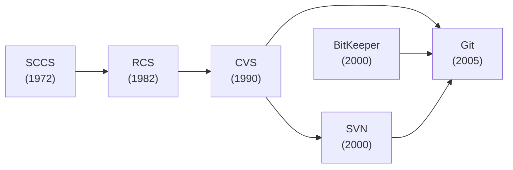
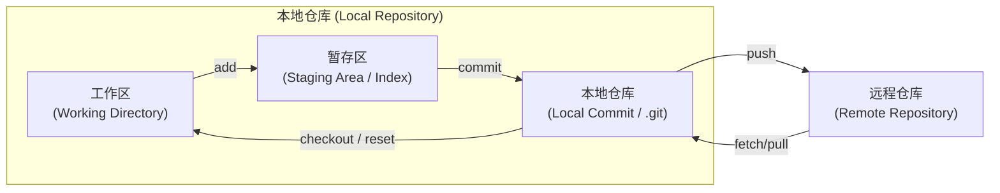

# Git 简介

## 回顾一下曾经做大作业的时候, 是否存在...

- 两个人通过微信发代码来同步?
- 代码改了很多, 突然出问题了, 此时不知道改了什么?
- 两个人同时修改了一个文件, 结果互相不知道对方修改了什么?
- 用清华云盘同步文件, 结果出现一万个 SFConfict?

## 所以我们需要一个系统, 用于...

- 找出不同版本 (也就是每次修改) 之间的差异
- 告诉你谁改了什么, 什么时候改的
- 告诉你为什么要这么改
- 如果出问题了, 可以方便地在不同版本之间切换

---

# Git 的历史

- 于是在过去的 50 年间, 程序员们设计了很多版本控制系统 (Version Control System, VCS)
- 终于, 在 2005 年, Linux 的创始人 Linus Torvalds 受不了当时 Linux 内核的版本控制的不便, 设计了 **Git**

<br />



---

# Git 的基本结构

- 工作区: 工作目录 (你的代码所在的文件夹)
- 暂存区: 临时的缓存 (做一个临时的标记)
- 本地仓库: 真正存储版本信息的地方 (.git 文件夹)
- 远程仓库: 存储在服务器上的仓库 (GitHub、GitLab、Gitee 等)

<br />



---

# Git 的基本命令

- init: 初始化一个新的 Git 仓库
    ```bash
    $ git init
    ```
- clone: 克隆一个远程仓库
    ```bash
    $ git clone git@git.tsinghua.edu.cn:dyk22/2025-django-hw.git
    ```
- status: 检查当前仓库的状态
    ```bash
    $ git status
    On branch master
    Changes not staged for commit:
      (use "git add <file>..." to update what will be committed)
      (use "git restore <file>..." to discard changes in working directory)
            modified:   slides.md

    Untracked files:
      (use "git add <file>..." to include in what will be committed)
            pages/git.md

    no changes added to commit (use "git add" and/or "git commit -a")
    ```

---

## Git 的基本命令

- add: 将文件添加到暂存区
    ```bash
    $ git add pages/git.md
    
    ```