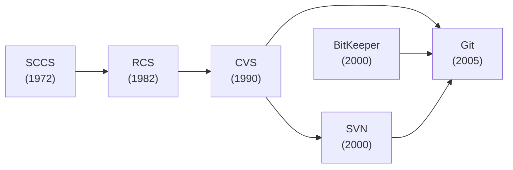
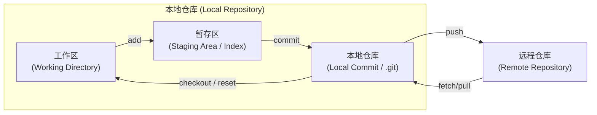
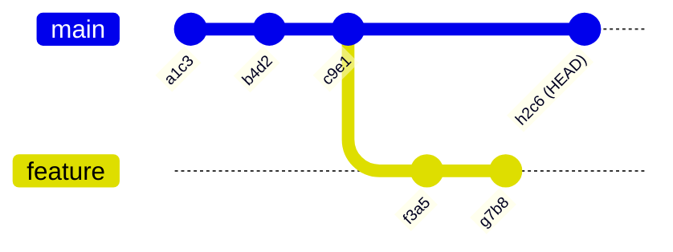

# Git 简介

## 回顾一下曾经做大作业的时候, 是否存在...

- 两个人通过微信发代码来同步?
- 代码改了很多, 突然出问题了, 此时不知道改了什么?
- 两个人同时修改了一个文件, 结果互相不知道对方修改了什么?
- 用清华云盘同步文件, 结果出现一万个 SFConfict?

## 所以我们需要一个系统, 用于...

- 找出不同版本 (也就是每次修改) 之间的差异
- 告诉你谁改了什么, 什么时候改的
- 告诉你为什么要这么改
- 如果出问题了, 可以方便地在不同版本之间切换

---

# Git 的历史

- 于是在过去的 50 年间, 程序员们设计了很多版本控制系统 (Version Control System, VCS)
- 终于, 在 2005 年, Linux 的创始人 Linus Torvalds 受不了当时 Linux 内核的版本控制的不便, 设计了 **Git**

<br />



---

# Git 的基本结构

- 工作区: 工作目录 (你的代码所在的文件夹)
- 暂存区: 临时的缓存 (做一个临时的标记)
- 本地仓库: 真正存储版本信息的地方 (.git 文件夹)
- 远程仓库: 存储在服务器上的仓库 (GitHub、GitLab、Gitee 等)

<br />



---

# Git 的基本命令 (初始化)

- init: 初始化一个新的 Git 仓库
    ```bash
    $ git init
    ```

- clone: 克隆一个远程仓库
    ```bash
    $ git clone git@git.tsinghua.edu.cn:dyk22/2025-django-hw.git
    ```

- status: 检查当前仓库的状态
    ```bash
    $ git status
    On branch master
    Changes not staged for commit:
      (use "git add <file>..." to update what will be committed)
      (use "git restore <file>..." to discard changes in working directory)
            modified:   slides.md

    Untracked files:
      (use "git add <file>..." to include in what will be committed)
            pages/git.md

    no changes added to commit (use "git add" and/or "git commit -a")
    ```

---

# Git 的基本命令 (添加与提交)

- add: 将文件添加到暂存区
    ```bash
    $ git add pages/git.md
    $ git status
    On branch master
    Changes to be committed:
      (use "git restore --staged <file>..." to unstage)
            new file:   pages/git.md

    Changes not staged for commit:
      (use "git add <file>..." to update what will be committed)
      (use "git restore <file>..." to discard changes in working directory)
            modified:   slides.md
    ```

- commit: 提交更改到当前分支
    ```bash
    $ git commit -m "Add git.md"
    [master 22e2a13] Add git.md
     1 file changed, 108 insertions(+)
     create mode 100644 pages/git.md
    ```

---

# Git 的基本命令 (查看与比较)

- log: 查看提交历史
    ```bash
    $ git log --oneline --decorate --color --graph
    * 22e2a13 (HEAD -> master) Add git.md
    * ea15ba0 Init commit
    ```

- diff: 查看文件的更改内容
    ```bash
    $ git diff
    diff --git a/pages/git.md b/pages/git.md
    index c0abb3e..ba3641a 100644
    --- a/pages/git.md
    +++ b/pages/git.md
    @@ -99,10 +99,37 @@ flowchart LR
    
     ---
    
    -## Git 的基本命令
    +# Git 的基本命令
    ```

---

# Git 的基本命令 (远程与同步)

- remote: 管理远程仓库
    ```bash
    $ git remote add ajax git@github.com:THUSE-Course/2025-backend.git
    $ git remote
    origin
    ```

- push: 将本地提交推送到远程仓库
    ```bash
    $ git push --set-upstream origin master
    Enumerating objects: 62, done.
    ... <-- 省略若干行
    To github.com:THUSE-Course/2025-backend.git
     * [new branch]      master -> master
    branch 'master' set up to track 'origin/master'.
    ```

- pull: 从远程仓库拉取并合并更改 (这里没有更改)
    ```bash
    $ git pull
    Already up to date.
    ```
---

# Git 的分支管理 - 为什么?

- 前面的这些都没有解决多人协作的问题, 因为
  - 你和你的同学可能会同时修改同一个文件
  - 你们可能会在同一时间提交代码
  - 你们可能会在同一时间推送代码到远程仓库

- 同时, 假如一个新的功能开发需要 7 天时间完成, 那么
  - 如果你们在同一个分支上开发, 那么这个功能就会阻塞其他人的工作
  - 如果你选择这 7 天你都不提交代码, 那么你就会失去版本控制的好处 (比如出错回滚)
  - 如果你提交 (Commit) 但不推送 (Push), 那么你就失去了备份的好处 (比如电脑坏了)
  - 否则, 你就得频繁解决冲突 (甚至当你的功能开发了一半尚未完成时, 整个项目将无法构建)

---

# Git 的分支管理 - 是什么?

- 因此我们需要分支 (Branch), 它是:
  - 一棵树 (理论上是一棵树, 但也可能有孤立点, 但不会有环)
  - 每个节点是一个提交 (Commit), 有一个唯一的哈希值 (SHA)
  - 每一个分支是一个指向某个提交的指针 (Pointer)

- 一些概念
  - 主分支: 默认的分支, 第一个 Commit 一般是树根 (如下图 `a1c3`)
  - HEAD: 当前的分支指针, 代表了你当前所在的位置 (如下图 `h2c6`)

<br />



---

# Git 的分支管理 - 怎么做?

- 主分支应该是稳定的分支, 在任何时候可以部署与发布, 理论上不应该有 Bug
- 新的功能应该在新的分支上开发, 直到功能完成并且测试通过, 才合并到主分支
  - 可以考虑新建开发分支 `dev` 作为测试环境
  - 如果功能较为复杂, 可以考虑在功能分支上再创建子分支
  - 可以频繁地提交 (Commit), 但不一定要频繁地推送 (Push)
    - 但是不要写两行提交一次, 这样你想不出你应该写什么提交信息
- Commit 信息应当简洁明了, 精确概括本次更改的内容
  - 可以参考 https://www.conventionalcommits.org/en/v1.0.0/

---

# Git 的分支管理 - 怎么做?

- switch: 创建与切换分支
    ```bash
    $ git switch -c git_branching
    Switched to a new branch 'git_branching'
    ```

- branch: 管理分支
    ```bash
    $ git branch -vv
      git_bramching 22e2a13 Add git.md
    * git_branching 22e2a13 Add git.md
      master        22e2a13 [origin/master] Add git.md
    $ git branch -vv -d git_bramching 
    Deleted branch git_bramching (was 22e2a13).
    ```